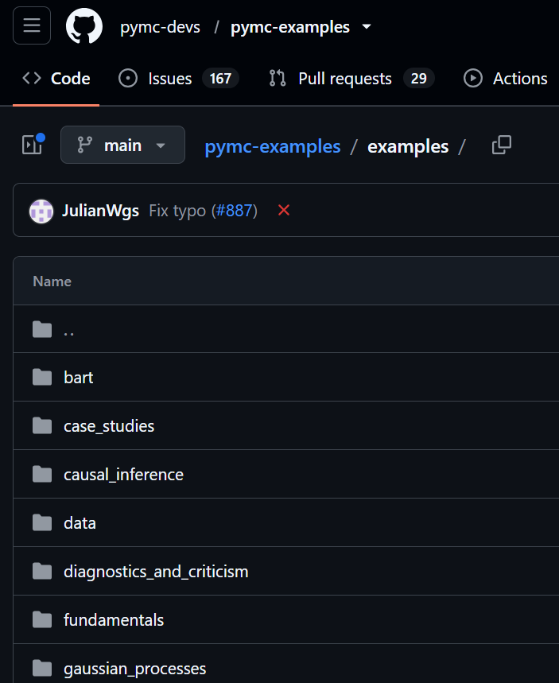
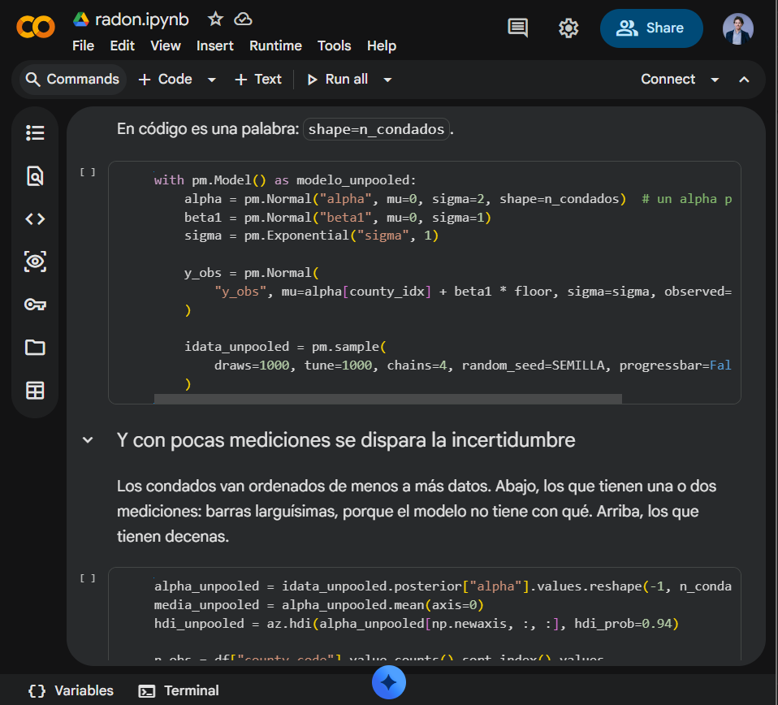
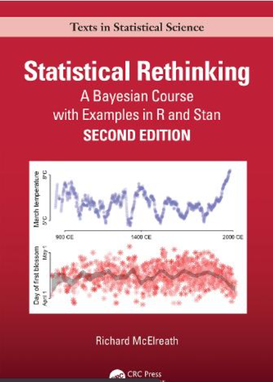

```{python}
#| label: setup
#| include: false

import numpy as np
import pandas as pd
import matplotlib.pyplot as plt

import pymc as pm
import pytensor.tensor as pt
import arviz as az
from scipy import stats

from src.estilo import ACENTO, GRISES, aplicar_estilo

aplicar_estilo()

SEMILLA = 42
```

## Lanzo una moneda 100 veces y salen 60 caras

::: {.notes}
Abrir aquí y no alargarse: la moneda es el gancho, no el tema. Se lanza el dato, se deja
la pregunta en el aire y se pasa. Nada de definir inferencia, ni de adelantar que luego
habrá dos enfoques. En la siguiente slide se pide respuesta a mano alzada, se cuentan los
síes y se sigue; no se abre debate, que se come el bloque. La moneda entera, hasta
"Vamos a no dar la vuelta al problema", no puede pasar de ocho minutos: lo que se gaste ahí
se lo quita al bloque de medios. "A qué me dedico" es un minuto: de dónde vengo y por qué doy este
seminario. No es un currículum, pero sí es la parte de empresa: es la credencial que esta
sala ha venido a comprar.
:::

## ¿Crees que la moneda favorece cara frente a cruz?

¿$p > 0{,}5$?


# Primer intento: simular

## Simulo 10.000 veces el experimento suponiendo que la moneda es justa

```{python}
#| label: graf-sim-hist

np.random.seed(SEMILLA)

n_lanzamientos = 100
caras_obs = 60

caras = np.random.binomial(n=n_lanzamientos, p=0.5, size=10_000)

fig, ax = plt.subplots(figsize=(9, 4))
ax.hist(caras, bins=range(30, 71), edgecolor="white", color="#666666", alpha=0.85)
ax.axvline(50, color="black", linestyle="--", linewidth=1.2, label="Valor esperado (50)")
ax.set_xlabel("Número de caras")
ax.set_ylabel("Frecuencia")
ax.legend()
plt.show()
```

## Cuento qué proporción de esas simulaciones da 60 caras o más

```{python}
#| label: graf-pvalor-hist

p_valor_sim = np.mean(caras >= caras_obs)

fig, ax = plt.subplots(figsize=(9, 4))
_, bordes, barras = ax.hist(
    caras, bins=range(30, 71), edgecolor="white", color="#BBBBBB", alpha=0.9
)
for barra, borde in zip(barras, bordes[:-1]):
    if borde >= caras_obs:
        barra.set_facecolor("#333333")
        barra.set_edgecolor("white")
        barra.set_hatch("///")

ax.axvline(caras_obs, color=ACENTO, linewidth=2)
ax.set_xlabel("Número de caras")
ax.set_ylabel("Frecuencia")
ax.set_title(f"p-valor simulado ≈ {p_valor_sim:.3f}".replace(".", ","))
plt.show()
```

::: aside
Ese número es, aproximadamente, el p-valor del contraste.
:::

::: {.notes}
El nombre se dice de palabra y no se proyecta: esto es el contraste de toda la vida, $H_0:
p = 0{,}5$ frente a $H_1: p > 0{,}5$, y esta sala se lo sabe de memoria. Escribirlo
sería la parte de la charla que menos les enseña.

Y avisar una vez, de palabra: la $p$ de la moneda es la probabilidad de cara, y el p-valor es
otra cosa. Mismo nombre, mala suerte, y a partir de aquí van a convivir en las mismas slides.

Pero decirlo no es opcional, y el sitio es este: si dentro de dos slides no ha quedado dicho
que lo que acabamos de simular es el contraste de siempre, el giro de "He dado la vuelta al
problema" no tiene contra qué girar.

Si alguien pregunta: sí, hay fórmulas para calcularlo sin simular, y no nos importan ahora.
:::

## ¿Te has dado cuenta de lo que acabo de hacer?

## He dado la vuelta al problema

- La pregunta era sobre **la moneda**: ¿es $p > 0{,}5$?
- La respuesta es sobre **los datos**, su distribución dado $p = 0{,}5$.

::: {.notes}
Este es el giro del bloque. En la slide anterior, callarse: la pregunta es retórica, pero
el silencio la hace funcionar. Los dos puntos se leen despacio y el que importa es el
segundo: hemos calculado la probabilidad de unos datos que no hemos visto —60 caras o
más, en repeticiones del experimento que no han ocurrido— y encima suponiendo cierto lo
contrario de lo que queríamos demostrar. Es el truco de Juan Tamariz, dar la vuelta a la
situación sin que se note.

Dejar claro, antes de entrar en el bayesiano, que el p-valor no está mal calculado:
responde a otra pregunta. Si no se dice, alguien entiende "entonces el contraste no
sirve" y ahí se va el resto del bloque.
:::

## Vamos a no dar la vuelta al problema

## La sesión de hoy va sobre:

- Qué resultados da la estadística bayesiana.
- Por qué (me parece que) son más intuitivos.
- Cómo se pone en práctica la estadística bayesiana.

::: aside
Esto es una charla, no un curso de 6 créditos, así que dejaré **muchas** cosas fuera.
:::

## Objetivo de hoy

- Estudiantes.
- Profesores.

## A qué me dedico {.custom-title}

{.nostretch width="50%" fig-alt="Logotipo de CUNEF" fig-align="center"}

{.nostretch width="50%" fig-alt="Logotipo de Ebiquity" fig-align="center"}

## Por cierto, te he traído un regalo {.custom-title}

Pero te doy más detalles al final.

# El lanzamiento de moneda, en bayesiano

## Observación. No digo que no hagas estadística frecuentista

- Resultados similares. 
- Interpretación diferente.

## El fundamento bayesiano

$$
P(p \mid \text{datos}) = \frac{P(\text{datos} \mid p) \cdot P(p)}{P(\text{datos})}
$$

- $P(p \mid \text{datos})$, **posteriori**, lo que buscas.
- $P(\text{datos} \mid p)$, **verosimilitud**, tu modelo.
- $P(p)$, **priori**, lo que crees en un principio.

::: aside

Probabilidades en todos los elementos.

:::

## Los métodos bayesianos requieren mucho cómputo

Parte de tu trabajo será elegir qué librería te gusta más. 

## PyMC

{.nostretch width="75%" fig-alt="Logotipo de PyMC"}


## En PyMC queda así

```{python}
#| label: modelo-moneda
#| echo: true

with pm.Model() as modelo_moneda:
    # priori:
    p_cara = pm.Uniform("p_cara", lower=0, upper=1)    
    # verosimilitud y datos
    y = pm.Binomial("y", n=100, p=p_cara, observed=60) 
    
    # ejecución:
    idata_moneda = pm.sample(
        draws=2000, tune=2000, chains=4, random_seed=SEMILLA, progressbar=False
    )
```


## El resultado es una distribución

```{python}
#| label: graf-posterior-moneda

p_cara_post = idata_moneda.posterior["p_cara"].values.flatten()

fig, ax = plt.subplots(figsize=(10, 5))
# con más barras, el ruido de la simulación abre un hueco en la moda (#96)
ax.hist(p_cara_post, bins=20, density=True, edgecolor="white", color="#666666", alpha=0.85)
ax.axvline(0.5, color="black", linestyle="--", linewidth=1.5, label="p = 0,5 (justa)")
ax.axvline(0.6, color=ACENTO, linewidth=2, label="proporción observada = 0,60")
ax.set_xlabel("p (probabilidad de cara)")
ax.set_ylabel("Densidad")
ax.legend()
plt.show()
```

## Esa distribución se simula iterativamente 

```{python}
#| label: graf-caminata

rng_mcmc = np.random.default_rng(SEMILLA)


def log_numerador(p):
    """El numerador de Bayes: priori uniforme por verosimilitud binomial, en logaritmos."""
    if not 0 < p < 1:
        return -np.inf
    return caras_obs * np.log(p) + (n_lanzamientos - caras_obs) * np.log(1 - p)


n_pasos = 2000
subida = 50
zoom = 200  # los pasos que se ven de cerca: con los dos mil no se distingue ninguno
cadena = np.empty(n_pasos)

actual = 0.10  # arranque deliberadamente malo: la cadena no sabe nada
for i in range(n_pasos):
    propuesta = actual + rng_mcmc.normal(0, 0.05)
    if np.log(rng_mcmc.uniform()) < log_numerador(propuesta) - log_numerador(actual):
        actual = propuesta
    cadena[i] = actual


def dibuja_recorrido(ax, hasta=n_pasos, detalle=False):
    """El recorrido de la cadena. Con detalle=True se ven los pasos y los rechazos."""
    ax.axvspan(0, subida, color="#DDDDDD", alpha=0.7, zorder=0,
               label="Subida inicial (descartada)")
    if detalle:
        ax.plot(cadena[:hasta], color=GRISES[1], linewidth=1.1, marker="o", markersize=2.5)
    else:
        ax.plot(cadena[:hasta], color=GRISES[2], linewidth=0.5)
    ax.axhline(0.6, color=ACENTO, linewidth=2, label="proporción observada = 0,60")
    ax.set_xlabel("Paso")
    ax.set_ylabel("p (probabilidad de cara)")
    ax.set_ylim(0, 0.8)


fig, ax = plt.subplots(figsize=(9, 4))
dibuja_recorrido(ax, hasta=zoom, detalle=True)
ax.legend(loc="lower right")
plt.show()
```

::: aside

Esta no es la simulación del verdadero algoritmo.

:::

::: {.notes}
La regla, en cuatro frases: estás en un valor de $p$, propones otro cercano, miras cuántas
veces más plausible es —priori por verosimilitud, nada más— y si es mejor, te mueves; si es
peor, te mueves con esa probabilidad. Dos mil veces.

Aquí se ven los doscientos primeros pasos de esos dos mil, porque con los dos mil no se
distingue ninguno. Señalar los tramos planos: son los rechazos, los pasos en los que la
cadena propone un valor peor y se queda donde estaba. Un tercio de las veces, más o menos.

El arranque en 0,10 es a propósito: la cadena no sabe nada cuando empieza, y los primeros
pasos son subida, no muestreo. Eso es, en parte, el `tune=2000` de la slide del modelo: PyMC
usa esos pasos para colocarse y para afinar el tamaño del paso, y luego los tira. La zona
sombreada es la parte de colocarse.

Y la línea de honestidad, que hay que decirla: PyMC no hace exactamente esto, hace NUTS, que
propone usando el gradiente y es mucho más listo. La idea de fondo es la misma. Y de paso,
por si alguien pregunta por qué el dibujo no es la traza de PyMC: en NUTS las muestras salen
casi independientes, el recorrido parece ruido blanco y ahí no se ve ni un paso corto ni un
rechazo. Justo lo que esta slide ha venido a enseñar.
:::

## El montón que deja el paseo es la posteriori

```{python}
#| label: graf-caminata-posteriori

fig, (ax1, ax2) = plt.subplots(
    1, 2, figsize=(9, 4), sharey=True, gridspec_kw={"width_ratios": [2, 1]}
)

dibuja_recorrido(ax1)  # ahora los dos mil pasos, sin detalle: importa el montón

ax2.hist(
    cadena[subida:], bins=30, density=True, orientation="horizontal",
    color="#666666", edgecolor="white", alpha=0.85,
)
ax2.axhline(0.6, color=ACENTO, linewidth=2)
ax2.set_xlabel("Densidad")
ax2.set_xticks([])

plt.tight_layout()
plt.show()
```

::: {.notes}
Es la misma cadena de antes, ahora entera: los dos mil pasos, con los doscientos de la slide
anterior metidos en el primer décimo. La banda gris del principio es la misma subida inicial,
aunque aquí ya no lleve leyenda, y al lado está el montón que deja el resto.

Y aquí está el truco, que es el título: como el paso se acepta según la plausibilidad
relativa, la cadena acaba pasando en cada zona un tiempo proporcional a lo plausible que es
esa zona. El recuento de visitas no es un dibujo parecido a la posteriori: es una muestra de
ella. Y no se ha resuelto ninguna integral por el camino.

Si conviene, volver un segundo a la slide del histograma de PyMC: es el mismo dibujo.

Y por qué funciona sin conocer la constante: para decidir si me muevo solo comparo dos
valores de $p$, y en esa comparación la constante normalizadora —el $P(\text{datos})$ del
denominador de Bayes, unas slides atrás— aparece arriba y abajo y se va. Eso es justo lo que
hace posible el muestreo: esa integral deja de poder calcularse en cuanto el modelo tiene
más de un puñado de parámetros. Con una rejilla de cien puntos por parámetro, los catorce del
modelo de medios serían $10^{28}$ puntos.

Referencia y parar: McElreath, *Statistical Rethinking* —el capítulo del rey Markov— y sus
clases en YouTube, que están enteras y gratis. Nada de balance detallado ni de ergodicidad,
que son otras dos horas. Son tres o cuatro minutos: si alguien pregunta cómo se sabe que la
cadena ha funcionado, que la traza y el `r_hat` llegan en el bloque del esqueleto.
:::

## Y ahora la pregunta original se responde contando

```{python}
#| label: prob-sesgo
#| echo: true

float(np.mean(p_cara_post > 0.5))
```

::: aside
Ese número es la probabilidad de que la probabilidad de obtener cara sea estrictamente mayor que 0,5 dada esta priori y esta verosimilitud.
:::

::: {.notes}
«Dada esta priori» no es letra pequeña. Por si alguien pregunta qué pasa si la cambio, los
números están medidos (#102), con prioris Beta que pesan lo mismo que los datos, como si
viniera de ver otras cien tiradas:

- Uniforme, la de la slide: 0,977.
- Beta(60, 40), convencida de que la moneda da 0,6: 0,998. Casi nada que ganar: los datos ya
  decían eso.
- Beta(20, 80), absurda, convencida de que da 0,2: **0,002**. La conclusión se da la vuelta,
  y la media de la posteriori se queda en 0,40, a medio camino entre el prejuicio y los datos.
- Y si el prejuicio pesa diez veces más, Beta(200, 800): 0,000. Cien tiradas no pueden con mil
  que nadie ha visto.

La lección: la priori es una afirmación, y se defiende como cualquier otra. Si es absurda, el
resultado también, por mucho MCMC que le eches encima. Cómo se pilla una priori absurda antes
de ajustar —la simulación previa— llega en el esqueleto.
:::

## Me costó años entender qué era un intervalo de confianza

```{python}
#| label: graf-hdi-moneda

hdi = az.hdi(p_cara_post, hdi_prob=0.95)

fig, ax = plt.subplots(figsize=(9, 4))
ax.hist(p_cara_post, bins=20, density=True, edgecolor="white", color="#BBBBBB", alpha=0.9)
ax.axvspan(hdi[0], hdi[1], color=ACENTO, alpha=0.18)
ax.axvline(0.5, color="black", linestyle="--", linewidth=1.5, label="p = 0,5")
ax.set_xlabel("p (probabilidad de cara)")
ax.set_ylabel("Densidad")
hdi_texto = [f"{extremo:.3f}".replace(".", ",") for extremo in hdi]
ax.set_title(f"Intervalo de credibilidad 95%: [{hdi_texto[0]}, {hdi_texto[1]}]")
ax.legend()
plt.show()
```

::: {.notes}
Las cifras, por si alguien las saca en el móvil: el intervalo de credibilidad exacto es
[0,503, 0,692]; el del título sale del muestreo y puede bailar en la tercera cifra. El IC de
Wilson al 95 % del mismo dato es [0,502, 0,691]. Difieren en una milésima. Y el p-valor exacto de una cola de la slide de la moneda, 0,0284,
se parece al complementario de la probabilidad de sesgo de dos slides atrás,
1 − 0,977 = 0,0230, pero no es el mismo número.

No es casualidad, y aquí hay un regalo para quien sepa del tema: la correspondencia exacta
existe, pero con el *mid-p-value*, no con el p-valor de siempre. Con priori uniforme y
$p_0 = 0{,}5$, $P(p < 0{,}5 \mid \text{datos}) = P(X > 60) + \tfrac{1}{2} P(X = 60) = 0{,}0230$,
clavado hasta el decimal quince. El porqué cabe en una frase: la posteriori es una
Beta(61, 41), y la probabilidad de que quede por debajo de 0,5 es la de sacar 61 caras o más
en 101 tiradas de una moneda justa, las cien de verdad más una de propina. El p-valor de
siempre cuenta el 60 entero; la posteriori, medio. De ahí 0,0284 contra 0,0230.

Lo que cambia no es el número, es la frase que puedes decir sobre él. "Hay un 95 % de
probabilidad de que $p$ esté en este intervalo" frente a "si repitiera el experimento
muchas veces, el 95 % de esos intervalos contendría el $p$ verdadero". La primera es la
que vas a querer decir cuando te toque defender un número en una reunión.

No generalizar en voz alta: la coincidencia depende de la hipótesis de una cola y de la
priori plana. Si el bayesiano contrasta una nula puntual —pone una masa de probabilidad justo
en $p = 0{,}5$ y la compara con el resto—, se rompe, y bastante: ahí está la paradoja de
Lindley, que no hace falta nombrar si nadie pregunta tan concreto. El p-valor, en cambio, no
se entera: da lo mismo con $H_0: p = 0{,}5$ que con $H_0: p \leq 0{,}5$.
:::

## Resumen del bloque

::: {.incremental}

- El frecuentista calcula la probabilidad de **los datos**, o de otros más extremos.
- El bayesiano calcula la probabilidad del **parámetro**.
- El segundo responde a la pregunta que yo hice.

:::

## Las cosas malas

- Elegir la priori. 
- Más cómputo: segundos o minutos donde mínimos cuadrados tarda milisegundos.

## Esto ha sido la teoría. Vamos a la práctica

# Cuál es el retorno de invertir un euro en publicidad

```{python}
#| label: datos-mmm
#| include: false

URL_DATOS = (
    "https://raw.githubusercontent.com/google/meridian/v1.1.5/"
    "meridian/data/simulated_data/csv/national_all_channels.csv"
)

df = pd.read_csv(URL_DATOS, parse_dates=["time"])
df["revenue"] = df["conversions"] * df["revenue_per_conversion"]

CANALES = [f"Channel{i}" for i in range(5)]
CONTROLES = ["competitor_sales_control", "sentiment_score_control"]
```

## `{python} len(df)` semanas de inversión publicitaria

- Inversión en cinco medios publicitarios.
- Ventas de la competencia y sentimiento de marca.
- Variable objetivo: ingresos (`revenue`).

::: aside

Datos simulados de Google a partir de su experiencia en el sector. 

Fuente: https://github.com/google/meridian

:::

::: {.notes}
Si preguntan si recuperamos el ROI verdadero: Google no publica los valores generadores de
este CSV, así que no hay contra qué comparar. No se puede decir "hemos acertado"; sí se
puede decir que el modelo es consistente puertas adentro, que es lo que sí se enseña en la
charla: la priori se mueve donde hay señal (el ROI) y se queda igual donde no la hay
(`alpha`), y la predictiva posterior se contrasta contra los datos que sí tenemos
(backup: `ajuste`).
:::

## Lo que pregunta negocio es cuánto devuelve cada medio, su ROI

La respuesta es una distribución.

## Cuantificamos el impacto a lo largo del tiempo

```{python}
#| label: graf-serie-revenue-canal

canal = "Channel0"

fig, ejes = plt.subplots(2, 1, figsize=(10, 4), sharex=True,
                         gridspec_kw={"height_ratios": [3, 2]})

ejes[0].plot(df["time"], df["revenue"] / 1e6, color=ACENTO)
ejes[0].set_ylabel("Ingresos (M€)")

ejes[1].bar(df["time"], df[f"{canal}_spend"] / 1e3, width=6, color=GRISES[1])
ejes[1].set_ylabel(f"{canal} (k€)")

fig.tight_layout()
plt.show()
```

# El esqueleto: nivel y controles del KPI

## Una primera regresión, sin publi

$$y = \mu + \gamma_1\cdot x_1 + \gamma_2\cdot x_2 + \varepsilon$$

- $y$: ingresos semanales, estandarizados.
- $x_i$: competencia y sentimiento de marca, estandarizados.
- $\mu$: nivel de ingresos semanales, en desviaciones típicas del KPI.
- $\varepsilon \sim \mathcal{N}(0, \sigma)$

```{python}
#| label: procesado-esqueleto
#| echo: false
y = df["revenue"].to_numpy()
x = df[CONTROLES].to_numpy(float)
semanas = df["time"].dt.date.astype(str)

y_media, y_sd = y.mean(), y.std()
y_esc = (y - y_media) / y_sd
x_esc = (x - x.mean(axis=0)) / x.std(axis=0)
```

## La regresión de antes, pero con PyMC

```{python}
#| label: modelo-esqueleto
#| echo: true
with pm.Model(coords={"control": CONTROLES, "semana": semanas}) as esqueleto:
    mu = pm.Normal("mu", 0.0, 1.0)
    gamma = pm.Normal("gamma", 0.0, 1.0, dims="control")
    sigma = pm.Exponential("sigma", 1.0)

    media = mu + pt.dot(x_esc, gamma)
    pm.Normal("y", mu=media, sigma=sigma, observed=y_esc, dims="semana")
```

## Antes de usar datos, ¿las prioris tienen sentido?

```{python}
#| label: prev-esqueleto
#| include: false

def construir_esqueleto(mu_sd=1.0, gamma_sd=1.0, sigma_prior="exp"):
    """El esqueleto con las prioris como argumentos, para poder compararlas."""
    with pm.Model(coords={"control": CONTROLES, "semana": semanas}) as modelo:
        mu = pm.Normal("mu", 0.0, mu_sd)
        gamma = pm.Normal("gamma", 0.0, gamma_sd, dims="control")
        if sigma_prior == "exp":
            sigma = pm.Exponential("sigma", 1.0)
        else:
            sigma = pm.HalfNormal("sigma", 5.0)

        media = mu + pt.dot(x_esc, gamma)
        pm.Normal("y", mu=media, sigma=sigma, observed=y_esc, dims="semana")
    return modelo


def ingresos_previos(modelo, draws=500):
    """Simula series de ingresos desde la priori y las devuelve en euros."""
    with modelo:
        previa = pm.sample_prior_predictive(draws=draws, random_seed=SEMILLA)
    return previa.prior_predictive["y"].values.reshape(-1, len(df)) * y_sd + y_media
```

```{python}
#| label: graf-previas-esqueleto

y_previo = ingresos_previos(esqueleto)

meridian = construir_esqueleto(mu_sd=5.0, gamma_sd=5.0, sigma_prior="halfnormal")
y_meridian = ingresos_previos(meridian)
pct_negativas_meridian = 100 * (y_meridian < 0).mean()

fig, ejes = plt.subplots(1, 2, figsize=(11, 4))

titulos = ["Normal(0, 1) y Exponential(1)", "Normal(0, 5) y HalfNormal(5)"]
for eje, simulado, titulo in zip(ejes, [y_previo, y_meridian], titulos):
    eje.hist(simulado.ravel() / 1e6, bins=80, color="#AAAAAA", density=True,
             label="simulado desde la priori")
    eje.hist(y / 1e6, bins=30, color=ACENTO, density=True, alpha=0.8, label="observado")
    eje.axvline(0, color="black", linestyle="--", linewidth=1.2)
    eje.set_title(titulo)
    eje.set_xlabel("Ingresos semanales (M€)")

ejes[0].set_ylabel("Densidad")
ejes[0].legend()

fig.tight_layout()
plt.show()
```

A la derecha, el `{python} f"{pct_negativas_meridian:.1f}"` % de las semanas simuladas factura negativo.

::: {.notes}
Las prioris de Meridian no son un error: están pensadas para su modelo, jerárquico por
regiones, no para este. Y cuidado con lo que se dice: aquí los datos también las tapan.
Ajustado el esqueleto con ellas, la posteriori sale igual (`gamma` −0,417 frente a −0,415 y
0,099 frente a 0,099; `sigma` 0,937 frente a 0,933): con 156 semanas y tres parámetros, a
unas prioris tan anchas se las come el dato. El problema no es el resultado, es el
principio: un modelo que, antes de mirar un solo dato, se cree que la empresa vende menos
que nada varias semanas al año está mal escrito, aunque aquí los datos lo arreglen. En el
modelo de medios, donde los datos dicen menos, la priori sí mueve el resultado, y se verá
con `mu`.

Y decirlo una vez con su nombre: esto que está proyectado es una **comparación de
predictivas previas**. No usa datos: el histograma morado está solo de referencia. No es un
análisis de sensibilidad a la priori, que sería ajustar con las dos y comparar las
posterioris; hecho, es el párrafo de arriba, y dice que el esqueleto no es sensible a la
priori. Con profesores en la sala, nombrar bien las dos cosas vale por medio argumento
cuando llegue la pregunta de si esto no es subjetivo: la predictiva previa pilla la priori
absurda antes de ajustar, y la sensibilidad mide cuánto ha importado.
:::

## Ajusto...

```{python}
#| label: ajuste-esqueleto
#| echo: true

with esqueleto:
    idata_esqueleto = pm.sample(
        draws=2000, tune=2000, chains=4, target_accept=0.9,
        random_seed=SEMILLA, progressbar=False,
    )
```

## ...y diagnostico

```{python}
#| label: diagnostico-esqueleto
#| include: false

resumen_esqueleto = az.summary(idata_esqueleto, var_names=["mu", "gamma", "sigma"])
divergencias_esqueleto = int(idata_esqueleto.sample_stats["diverging"].sum())
```

```{python}
#| label: graf-traza-esqueleto

az.plot_trace(idata_esqueleto, var_names=["mu", "gamma", "sigma"], compact=True,
              figsize=(11, 3.6))
plt.tight_layout()
plt.show()
```

::: aside

- `r_hat` máximo `{python} f"{resumen_esqueleto['r_hat'].max():.2f}".replace(".", ",")`,
- `ess_bulk` mínimo `{python} int(resumen_esqueleto['ess_bulk'].min())`, 
- divergencias `{python} divergencias_esqueleto`.

:::

::: {.notes}
Tres segundos en un portátil, y esto es la mitad de la respuesta a "¿necesito una máquina
para esto?": la otra mitad llega con el modelo de medios.

La otra comprobación, la predictiva posterior, aquí solo se nombra: el modelo reproduce los
datos que ha visto. Se ve entera en el bloque de medios, donde además dice algo que aquí no
diría.
:::

## Cada parámetro es una distribución, y se lee en euros

```{python}
#| label: interpretacion-esqueleto
#| include: false

sigma_esqueleto = float(idata_esqueleto.posterior["sigma"].mean())
varianza_explicada_esqueleto = 1 - sigma_esqueleto ** 2

# gamma y sigma están en desviaciones típicas del KPI: por y_sd, en euros semanales.
hdi_esqueleto = az.hdi(idata_esqueleto, var_names=["gamma", "sigma"], hdi_prob=0.9) * y_sd
hdi_competencia = hdi_esqueleto["gamma"].sel(control="competitor_sales_control").values
hdi_sentimiento = hdi_esqueleto["gamma"].sel(control="sentiment_score_control").values
hdi_sigma_euros = hdi_esqueleto["sigma"].values

gamma_esqueleto = idata_esqueleto.posterior["gamma"]
competencia_euros = gamma_esqueleto.sel(control="competitor_sales_control").values.ravel() * y_sd
sentimiento_euros = gamma_esqueleto.sel(control="sentiment_score_control").values.ravel() * y_sd

p_sentimiento_sube = float((sentimiento_euros > 0).mean())

def euros(valor):
    """Redondea a miles y separa con punto: -164008.5 -> '−164.000'."""
    return f"{round(valor, -3):,.0f}".replace(",", ".").replace("-", "−")
```

:::: {.columns}

::: {.column width="60%"}
```{python}
#| label: graf-posteriori-competencia

fig, ax = plt.subplots(figsize=(6, 4.5))
ax.hist(competencia_euros / 1e3, bins=40, density=True, edgecolor="white",
        color="#BBBBBB", alpha=0.9)
ax.axvspan(hdi_competencia[0] / 1e3, hdi_competencia[1] / 1e3, color=ACENTO, alpha=0.18)
ax.set_xlabel("Efecto en la facturación semanal (k€)\npor cada desviación típica de sus ventas")
ax.set_ylabel("Densidad")
ax.set_title("Ventas de la competencia")
plt.show()
```

:::

::: {.column width="40%"}
Competencia, por cada desviación típica que suben sus ventas: entre `{python} euros(hdi_competencia[0])` y `{python} euros(hdi_competencia[1])` € a la semana, con un 90 % de probabilidad.
:::

::::

::: {.notes}
Con prioris flojas y `{python} len(df)` filas, la priori no manda: los centros son los de
mínimos cuadrados sobre la ecuación del principio del bloque (−0,42 y 0,10, en desviaciones
típicas), y si alguien lo comprueba, coinciden. Quien quiera ver a la priori mandar que
espere al bloque de medios, donde `mu` pasa de `Normal(0, 1)` a `Normal(0, 5)` porque el
modelo es otro. Lo que cambia aquí no es el número, es la lectura: cada frase lleva su
incertidumbre en euros, y se puede decir en una reunión sin traducir.

La unidad, que es donde se tropieza: `gamma` por la desviación típica de los ingresos da
euros semanales **por cada desviación típica que suben las ventas de la competencia**. No es
«la competencia me quita tanto a la semana»: es cuánto cambia la facturación cuando la
competencia vende una desviación típica más de lo normal.

Y decir en voz alta, porque no está en ninguna slide y el bloque de medios lo cobra: los dos
controles explican el `{python} f"{100 * varianza_explicada_esqueleto:.0f}"` % de la varianza,
y la desviación típica de lo que una semana se aparta de lo previsto está entre
`{python} euros(hdi_sigma_euros[0])` y `{python} euros(hdi_sigma_euros[1])` €: una semana
normal falla por esa cantidad, arriba o abajo, y alguna por el doble. Es poco lo explicado, y
está bien que lo sea: el muestreo es impecable y el modelo, flojo. Las dos cosas a la vez,
que en medios vuelven.
:::

## Con el sentimiento de marca tenemos muchas dudas

:::: {.columns}

::: {.column width="60%"}
```{python}
#| label: graf-posteriori-sentimiento

sentimiento_k = sentimiento_euros / 1e3
# barras de 10 k€ con un borde en el cero, para que ninguna quede a medias entre los colores
bordes = np.arange(np.floor(sentimiento_k.min() / 10) * 10, sentimiento_k.max() + 10, 10)

fig, ax = plt.subplots(figsize=(6, 4.5))
_, bordes, barras = ax.hist(sentimiento_k, bins=bordes, density=True,
                            edgecolor="white", color="#BBBBBB", alpha=0.9)
for barra, borde in zip(barras, bordes[:-1]):
    if borde >= 0:
        barra.set_facecolor(ACENTO)
ax.axvline(0, color="black", linestyle="--", linewidth=1.5)
ax.set_xlabel("Efecto en la facturación semanal (k€)\npor cada desviación típica del sentimiento")
ax.set_ylabel("Densidad")
ax.set_title(f"P(suma) = {100 * p_sentimiento_sube:.0f} %")
plt.show()
```

:::

::: {.column width="40%"}
- `{python} f"{100 * p_sentimiento_sube:.0f}"` % de que sume.
- Entre `{python} euros(hdi_sentimiento[0])` y `{python} euros(hdi_sentimiento[1])` € a la semana, por cada desviación típica.
- El intervalo cruza el cero.
:::

::::

::: {.notes}
El número del título es el área morada, contada: el mismo gesto que el `P(p > 0,5)` de la
moneda. Señalarlo con el dedo.

El sentimiento es el que merece la pausa. Con mínimos cuadrados sobre la misma ecuación
sale con un p-valor de 0,21, «no significativo», y ahí se acaba la conversación. Aquí sale
un `{python} f"{100 * p_sentimiento_sube:.0f}"` %. Cuidado con cómo se dice: no es que la
bayesiana vea un efecto que el p-valor no ve. Son los mismos datos respondiendo a otra
pregunta. El p-valor dice cómo de raros serían estos datos si el efecto fuera cero; la
posteriori, qué me creo del efecto después de verlos. Es la vuelta al problema de la moneda,
otra vez. Y el `{python} f"{100 * p_sentimiento_sube:.0f}"` % no autoriza a decir que el
sentimiento funciona: el intervalo cruza el cero, y eso también va en la frase.

Y los números cuadran, que es lo bonito: ese 0,21 es a dos colas; a una cola es 0,11, y la
probabilidad de que el efecto reste es 1 − 0,89 = 0,11. Con prioris flojas y un modelo
normal, las dos cifras son casi la misma, como en la moneda. La bayesiana no ha encontrado
nada que el p-valor no viera: lo dice en otro idioma.

Ten preparada la pregunta de vuelta, porque en esta sala alguien la hace: ¿y en el modelo
completo? Ahí el sentimiento cambia de signo. Con los medios dentro, la probabilidad de que
sume cae a un 2 %, y la competencia pasa de −0,41 a −0,75 desviaciones típicas. Es el sesgo
por variable omitida de toda la vida, que conocen de mínimos cuadrados: el esqueleto no tiene
medios, y lo que hacen los medios se lo reparten los controles. Esta slide es un ejercicio de
cómo se lee una posteriori, no una conclusión sobre el sentimiento. Y deja otra lección: la
posteriori depende del modelo, no solo de la priori.

Y la frase que sostiene el resto de la charla: no me paso a bayesiana porque mínimos
cuadrados falle aquí. Me paso porque el modelo del bloque siguiente —adstock, la priori
sobre el ROI, `beta` deducida— no se puede escribir con mínimos cuadrados.
:::

## Ahora metemos los medios (que es para lo que nos pagan)

# El modelo de medios: ¿qué prioris necesitamos?

```{python}
#| label: datos-medios
#| include: false

MAX_LAG = 8  # rezagos del adstock, el valor por defecto de Meridian

# Cada canal, dividido por la mediana de sus semanas con inversión: una unidad es "una
# semana normal de ese canal". Ni media ni máximo: hay canales con semanas a cero.
# `gasto`/`gasto_esc`, no `x`/`x_esc`: ese nombre ya lo usan los controles del esqueleto.
gasto = df[[f"{c}_spend" for c in CANALES]].to_numpy(float)
escala_medios = np.array([np.median(col[col > 0]) for col in gasto.T])
gasto_esc = gasto / escala_medios
gasto_total = gasto.sum(axis=0)

# rezagos[t, l, m] = canal m en t - l, con ceros antes del principio de la serie. Así el
# adstock es un producto y no un bucle.
rezagos = np.zeros((len(df), MAX_LAG + 1, len(CANALES)))
for lag in range(MAX_LAG + 1):
    rezagos[lag:, lag, :] = gasto_esc[: len(df) - lag, :]


def pesos_adstock(alpha, max_lag=MAX_LAG):
    """Pesos del adstock geométrico normalizado. Vale para numpy y para pytensor."""
    pesos = alpha[:, None] ** np.arange(max_lag + 1)[None, :]
    return pesos / pesos.sum(axis=1, keepdims=True)
```

## El impacto de un anuncio no se acaba la semana en que se emite

```{python}
#| label: graf-adstock

fig, eje = plt.subplots(figsize=(9, 4))

lags = np.arange(MAX_LAG + 1)
for alpha_, color in zip([0.1, 0.4, 0.7, 0.9], GRISES[:3] + [ACENTO]):
    pesos_ = pesos_adstock(np.array([alpha_]))[0]
    vida_media = np.log(0.5) / np.log(alpha_)
    cifras = f"α = {alpha_} (vida media {vida_media:.1f}".replace(".", ",")
    eje.plot(lags, pesos_, "o-", color=color, label=f"{cifras} sem.)")
eje.set_xlabel("Semanas desde la impresión")
eje.set_ylabel("Peso")
eje.set_title("Efecto Ad-stock")
eje.legend(fontsize=11)

plt.show()
```

::: aside

Priori: `alpha ~ Uniform(0, 1)`: ni idea de cuánto dura.

:::

::: {.notes}
El adstock arregla uno de los dos supuestos falsos de una regresión sobre la inversión sin
más: que el anuncio de esta semana no vende nada la semana que viene. El otro —que el euro
un millón hace lo mismo que el primero— es la saturación, la curva de Hill, y hoy se queda
fuera. Se dice de palabra y se sigue: se ha probado, mete un parámetro por canal que los
datos no saben estimar, ensancha los intervalos del ROI y no cambia el orden de los
canales. Diez minutos de explicación que no tienen nada de bayesiano.

La `Uniform(0, 1)` de `alpha` no es pereza: es la respuesta honesta. Y al final del bloque
hay que decir que la posteriori la devuelve casi tal cual: estos datos no distinguen un
canal con memoria de una semana de otro con memoria de un mes.

El porqué, por si lo preguntan: como los pesos suman uno, sumar el adstock de un canal a lo
largo de la serie da prácticamente su inversión total, valga `alpha` 0,1 o 0,9. Se pierde
entre un 0,1 % y un 2 %, el arrastre de las últimas semanas, que cae fuera de la serie. O sea
que la contribución total del canal no depende de `alpha`: lo único que `alpha` mueve es el
reparto en el tiempo. Y ese reparto sí se puede aprender, pero hace falta señal: con 156
semanas, un modelo que explica un 30 % de la varianza y tres canales que van juntos
(`Channel2`, `Channel3` y `Channel4` correlan entre 0,62 y 0,70), no la hay. Está medido: con
los mismos gastos y un ruido cuatro veces menor, el mismo modelo recupera los `alpha` con los
que se simularon los datos. Así que no es la normalización, es el ruido. La normalización se
queda porque es lo que hace limpia la cuenta de `beta` a partir del ROI.

Si preguntan qué asume antes del principio de la serie: `rezagos` rellena con ceros, así
que las primeras ocho semanas dan por hecho que no hubo inversión antes del primer dato.
Es lo que hace Meridian, y con 156 semanas no le mueve el ROI a nadie, pero es la pregunta
natural de quien ha leído el código.
:::

## Y ahora `beta`. ¿Alguien tiene una intuición sobre `beta`?

- Variable independiente transformada. 
- KPI estandarizado.
<!-- - `beta`: desviaciones típicas de ingreso por unidad de inversión rezagada y dividida entre su mediana. -->

::: aside

El de marketing no sabrá guiarte.

::: 

::: {.notes}
Esta slide es una pregunta a la sala y un silencio. No rellenarlo. Nadie tiene esa
intuición: yo tampoco, y llevo años con esto. Si alguien levanta la mano, preguntarle qué
valor le parece razonable y dejar que se oiga en voz alta lo raro que suena.

Si alguien pide las unidades de `beta`, decirlas enteras y despacio, que ahí está el chiste:
desviaciones típicas de ingreso por unidad de inversión rezagada y dividida entre su
mediana. Son las de verdad, no una caricatura.

Si preguntan por qué modelamos facturación y no conversiones —y en una sala de marketing
lo preguntan—: el modelo es exactamente el mismo, lo que cambia es que para poner la
priori sobre el ROI sigues necesitando un euro por unidad. Sin ese número, la priori
vuelve a `beta`, y a `beta` no la sabe poner nadie, que es justo lo que acaba de pasar en
esta slide. Por eso el CSV de Google trae `revenue_per_conversion` como columna de datos:
ese valor se da, no se estima.

Y la consecuencia, que es la parte que interesa: cuando el valor por conversión no es
constante, y encima es incierto, la priori del ROI carga con dos incertidumbres a la vez
—cuánto mueve el medio las conversiones y cuánto vale cada una— y ya no se puede auditar
por separado. En estos datos no pasa: el valor por conversión son dos céntimos clavados,
varía un 0,08 % en las 156 semanas, así que modelar conversiones o facturación es el mismo
modelo con otro eje.
:::

## Sobre lo que sí tiene intuición es sobre el ROI

```{python}
#| label: graf-priori-roi

priori_roi = stats.lognorm(s=0.9, scale=np.exp(0.2))
roi_bajo, roi_alto = priori_roi.ppf(0.05), priori_roi.ppf(0.95)

rejilla_roi = np.linspace(0, 8, 400)
densidad_roi = priori_roi.pdf(rejilla_roi)

fig, eje = plt.subplots(figsize=(9, 4))
eje.plot(rejilla_roi, densidad_roi, color=GRISES[1], linewidth=2)
eje.fill_between(rejilla_roi, densidad_roi, color=ACENTO, alpha=0.2,
                 where=(rejilla_roi >= roi_bajo) & (rejilla_roi <= roi_alto),
                 label="90 % central")
eje.axvline(1.0, color="black", linestyle="--", linewidth=1.2,
            label="ROI = 1: recupera en ventas lo invertido")
eje.set_xlabel("ROI: euros de ingreso incremental por euro invertido")
eje.set_ylabel("Densidad")
eje.set_title("roi ~ LogNormal(0,2; 0,9)")
eje.legend()
plt.show()
```

::: aside 
Un `{python} f"{100 * priori_roi.cdf(1):.0f}"` % de probabilidad de no recuperar en ventas lo invertido.
:::

::: {.notes}
Traducida a la reunión: "asumo que la publicidad devuelve en ventas algo más de lo que
cuesta, pero admito casi cualquier cosa entre recuperar solo una cuarta parte y
quintuplicar, y me parece casi igual de probable no recuperarlo que recuperarlo". Es honesta
para quien no tiene ni idea. También
es enorme, y se le pone igual a los cinco canales, cuando uno se lleva siete veces más
presupuesto que otro. Que Meridian la traiga por defecto no es una recomendación: es lo
único que puede hacer una librería que no sabe de qué empresa le hablas.

Una precisión que en una sala de empresa te van a hacer: este ROI es ingreso incremental
entre inversión, lo que en marketing muchos llaman ROAS. ROI = 1 es recuperar en ventas lo
invertido, no ganar dinero: para eso hay que pagar además lo vendido. Con un margen del
30 %, el punto muerto en beneficio es un ROI de 3,3. Meridian lo llama ROI y aquí se mantiene
el nombre, pero no se dice «perder dinero».

Si la pregunta de la subjetividad cae aquí —y aquí es donde más papeletas tiene de caer
antes de tiempo—, la versión corta y seguir: sí, esto es una elección, y está escrita. Las
del frecuentista también son elecciones —qué covariables entran, qué forma funcional, dónde
se corta el p-valor— solo que no se escriben en ninguna tabla. La respuesta entera se da al
final del bloque, con el gráfico de priori contra posteriori delante; no adelantarla aquí.
:::

## `beta` deja de ser un parámetro: es una cuenta


$$
\beta_m \cdot sd(y) \cdot \sum_t \tilde{x}_{tm} = \text{roi}_m \cdot \text{gasto}_m
$$

$$
\beta_m = \frac{\text{roi}_m \cdot \text{gasto}_m}{sd(y) \cdot \sum_t \tilde{x}_{tm}}
$$

::: aside
La priori se escribe en las unidades en las que la gente sabe pensar. Lo demás es despejar.
:::

::: {.notes}
El ingreso incremental de un canal es lo que se pierde si lo apagas, y por construcción
vale su ROI por lo invertido: esa es la primera ecuación. En el modelo, ese ingreso es `beta`
por el adstock sumado en toda la serie, devuelto a euros con `sd(y)`. Se despeja `beta` y ya
está: la segunda.

Ojo con «lo que se pierde si lo apagas»: es una frase causal, y el modelo solo la sostiene
si nadie decide el presupuesto mirando la demanda que espera. Si marketing sube la inversión
justo antes de las semanas buenas, el modelo le atribuye al anuncio lo que era temporada, y
el ROI sale inflado; y este modelo tiene un nivel constante, sin estacionalidad. Con datos
simulados no pasa nada. En una empresa es la primera objeción seria, y la respuesta es la
del final del bloque: un experimento.
:::

## Con la priori tienes que tener en cuenta todo el modelo

- Esqueleto, `mu ~ Normal(0, 1)`.

- Ahora, `mu ~ Normal(0, 5)`. 

::: aside

Aquí `mu` ya no es el nivel de los ingresos: es lo que queda **después** de restar los medios. Damos libertad a ese nivel de ingresos sin medios.

:::


::: {.notes}
Esta es la lección del bloque, no un detalle de implementación. Con la priori apretada del
esqueleto, `mu` no puede bajar el nivel base todo lo que necesita, y el modelo resuelve la
pelea por donde menos se ve: bajando los ROI. El muestreador no se entera —cero
divergencias, `r_hat` 1,00—, así que ningún diagnóstico avisa. Está medido: con
`mu ~ Normal(0, 1)`, la mediana del ROI de `Channel0` pasa de 1,29 a 0,97 —cruza el 1—, la de
`Channel3` de 0,96 a 0,72 y la de `Channel4` de 0,82 a 0,69. Mismos datos y misma priori del
ROI: lo que ha cambiado es la priori de otro parámetro. Si cae la pregunta de la
subjetividad, este es el ejemplo más honesto que hay.

Y no hace falta esperar a la posteriori para saberlo: está en el panel de la derecha de la
simulación previa, dos slides más allá. Esa contribución de medios, dividida entre las 156
semanas y la desviación típica del KPI, es el nivel que `mu` tiene que compensar. Con la
priori del ROI, esa cuenta da una mediana de −3,9, casi cuatro sigmas de la priori del
esqueleto, y en el 70 % de las simulaciones pasa de tres, antes de ver un dato. La
simulación previa **sí** detecta el problema. Lo que no lo detecta es mirar solo el
histograma de `y`, que casi no se mueve si aprietas `mu`. Por eso la previa se mira
parámetro a parámetro y no solo en el KPI.
:::

## El modelo entero

```{python}
#| label: modelo-medios
#| echo: false

coords_medios = {"semana": semanas, "control": CONTROLES, "canal": CANALES}

with pm.Model(coords=coords_medios) as medios:
    alpha = pm.Uniform("alpha", 0.0, 1.0, dims="canal")
    roi = pm.LogNormal("roi", mu=0.2, sigma=0.9, dims="canal")
    gamma = pm.Normal("gamma", 0.0, 1.0, dims="control")
    mu = pm.Normal("mu", 0.0, 5.0)  
    sigma = pm.Exponential("sigma", 1.0)

    pesos = pesos_adstock(alpha)
    adstock = pt.sum(rezagos * pesos.T[None, :, :], axis=1)

    beta = pm.Deterministic(
        "beta", roi * gasto_total / (y_sd * pt.sum(adstock, axis=0)), dims="canal"
    )
    contribucion = pm.Deterministic("contribucion", roi * gasto_total, dims="canal")

    media = mu + pt.dot(adstock, beta) + pt.dot(x_esc, gamma)
    pm.Normal("y", mu=media, sigma=sigma, observed=y_esc, dims="semana")
```

```{python}
#| label: modelo-medios-show
#| echo: true
#| eval: false
# -> definiciones de objetos <-
with pm.Model(coords=coords_medios) as medios:
    alpha = pm.Uniform("alpha", 0.0, 1.0, dims="canal")
    roi = pm.LogNormal("roi", mu=0.2, sigma=0.9, dims="canal")
    # -> otras prioris conocidas aquí <-

    # -> cálculo de adstocks aquí <-
    
    beta = pm.Deterministic(
        "beta", roi * gasto_total / (y_sd * pt.sum(adstock, axis=0)), dims="canal"
    )
    contribucion = pm.Deterministic("contribucion", roi * gasto_total, dims="canal")

    media = mu + pt.dot(adstock, beta) + pt.dot(x_esc, gamma)
    pm.Normal("y", mu=media, sigma=sigma, observed=y_esc, dims="semana")
```

## ¿Cuánta publicidad hay metida en esa priori?

```{python}
#| label: graf-previa-medios

with medios:
    previa_medios = pm.sample_prior_predictive(draws=2000, random_seed=SEMILLA)

y_previo_medios = (
    previa_medios.prior_predictive["y"].values.reshape(-1, len(df)) * y_sd + y_media
)
contrib_previa = previa_medios.prior["contribucion"].values.reshape(-1, len(CANALES))
pct_previo = 100 * contrib_previa.sum(axis=1) / y.sum()

fig, ejes = plt.subplots(1, 2, figsize=(10, 3.8))

ejes[0].hist(y_previo_medios.ravel() / 1e6, bins=80, color="#AAAAAA", density=True,
             label="simulado desde la priori")
ejes[0].hist(y / 1e6, bins=30, color=ACENTO, density=True, alpha=0.8, label="observado")
ejes[0].set_xlabel("Ingresos semanales (M€)")
ejes[0].set_ylabel("Densidad")
ejes[0].legend(fontsize=10)

ejes[1].hist(pct_previo, bins=60, color=ACENTO)
ejes[1].set_xlabel("% de los ingresos que la priori\natribuye a los medios")

plt.tight_layout()
plt.show()
```

Mediana del `{python} f"{np.median(pct_previo):.0f}"` %, percentil 95 del `{python} f"{np.percentile(pct_previo, 95):.0f}"` %: antes de ver un solo dato.

::: {.notes}
El panel de la izquierda es el de siempre: ¿considera el modelo normales unos ingresos
imposibles? El de la derecha es el que importa, y es la pregunta que le vas a tener que
hacer a cualquier MMM, propio o de proveedor: qué contribución de medios asume tu priori
antes de mirar los datos. Si no saben responderla, el número que te den será el suyo, no
el de los datos.

Aquí el percentil 95 dice que le parece perfectamente normal que seis de cada diez euros
facturados vengan de los anuncios. Para comparar: la inversión de estos datos es el 17 % de
la facturación, así que con un ROI de 1 los medios explicarían un 17 %; seis de cada diez
exigirían un ROI medio de casi 4 en todos los canales a la vez. Cuando
tengas al jefe delante, aprieta la sigma de la lognormal, no su centro: el problema es la
cola.
:::

## 7 variables explicativas, 14 parámetros

```{python}
#| label: ajuste-medios
#| echo: false

with medios:
    idata_medios = pm.sample(
        draws=2000, tune=2000, chains=4, target_accept=0.95,
        random_seed=SEMILLA, progressbar=False,
    )
```

```{python}
#| label: ppc-medios-datos
#| include: false

with medios:
    idata_medios.extend(pm.sample_posterior_predictive(idata_medios, random_seed=SEMILLA))

resumen_medios = az.summary(idata_medios, var_names=["roi", "alpha", "gamma", "mu", "sigma"])
divergencias_medios = int(idata_medios.sample_stats["diverging"].sum())
mu_medios_post = float(idata_medios.posterior["mu"].mean())
sigma_medios = float(idata_medios.posterior["sigma"].mean())
```

```{python}
#| label: graf-traza-medios

az.plot_trace(idata_medios, var_names=["roi", "mu", "sigma"], compact=True,
              figsize=(11, 3.6))
plt.tight_layout()
plt.show()
```

- `r_hat` máximo `{python} f"{resumen_medios['r_hat'].max():.2f}".replace(".", ",")`, `ess_bulk` mínimo `{python} int(resumen_medios['ess_bulk'].min())`, divergencias `{python} divergencias_medios`.
- `mu` se ha ido a `{python} f"{mu_medios_post:.1f}".replace(".", ",").replace("-", "−")` (recuerda la priori `Normal(0, 5)`).

::: {.notes}
Aquí el ajuste ya no son tres segundos, es minuto y pico: catorce parámetros y un adstock
por medio. Las dos cifras salen de un portátil, y con eso está contestada la pregunta de
si hace falta máquina.

El `target_accept` es 0,95 y no el 0,9 del esqueleto: con 0,9 este modelo deja tres
divergencias. Está medido, no supuesto.

Y el segundo punto es la slide de `mu` cobrada: la posteriori está a casi tres
desviaciones típicas del centro de la priori que era correcta en el esqueleto. Aquella
priori no era mala, era mala **para este otro modelo**.
:::

## El muestreo bien; el modelo deja que desear

```{python}
#| label: graf-ppc-medios

az.plot_ppc(idata_medios, num_pp_samples=100, colors=[ACENTO, "#7A7A7A", "black"])
plt.show()
```

::: aside
Con los cinco canales dentro, la varianza explicada pasa del `{python} f"{100 * varianza_explicada_esqueleto:.0f}"` % al `{python} f"{100 * (1 - sigma_medios ** 2):.0f}"` %.

:::

::: {.notes}
Diagnosticar son dos preguntas, no una: el muestreo puede ser impecable y el modelo, flojo.
Las dos cosas son verdad a la vez, como en el esqueleto.

Y lo que dice la predictiva posterior es que la forma está bien: los cuantiles simulados
caen casi encima de los observados —los percentiles 1 y 99 salen en −2,39 y 2,37
desviaciones típicas en la simulación y en −2,32 y 2,26 en los datos—, y la peor y la mejor
semana de verdad no son raras para el modelo. El error gaussiano no molesta: la facturación
tiene un suelo en cero, pero está a catorce desviaciones típicas de la media y ninguna
semana se acerca. Lo flojo no es la forma, es cuánto explica.

Si preguntan si esto es un `R²`: casi. Es `1 − σ²` sobre el KPI estandarizado, la varianza
que el modelo no explica restada de uno, y se parece más a un `R²` ajustado que al de la
tabla de mínimos cuadrados. El «R² bayesiano» con nombre propio es otra cosa (Gelman y
otros, 2019), que se calcula muestra a muestra. Pero corre sobre el mismo KPI estandarizado
en los dos modelos, así que el salto del
`{python} f"{100 * varianza_explicada_esqueleto:.0f}"` % del esqueleto al
`{python} f"{100 * (1 - sigma_medios ** 2):.0f}"` % de aquí sí se puede leer en limpio: eso
es lo que han aportado los medios. (Detalle sin importancia práctica si alguien lo pincha:
es `1 − E[σ]²`, no `1 − E[σ²]`; la diferencia es de 0,25 puntos.)
:::

## La pregunta que le importa a alguien

```{python}
#| label: graf-hdi-roi

roi_post = idata_medios.posterior["roi"].values.reshape(-1, len(CANALES))
hdi_roi = az.hdi(idata_medios, var_names=["roi"], hdi_prob=0.9)["roi"].values
roi_mediana = np.median(roi_post, axis=0)

posiciones = np.arange(len(CANALES))

fig, eje = plt.subplots(figsize=(9, 4))
eje.hlines(posiciones, hdi_roi[:, 0], hdi_roi[:, 1], color=GRISES[3], linewidth=7)
eje.plot(roi_mediana, posiciones, "o", color=ACENTO, markersize=9)
eje.axvline(1.0, color="black", linestyle="--", linewidth=1.2, label="ROI = 1")
eje.set_yticks(posiciones)
eje.set_yticklabels(CANALES)
eje.invert_yaxis()
eje.set_xlabel("ROI: euros de ingreso incremental por euro invertido (HDI al 90 %)")
eje.set_title("¿Cuál es el ROI de cada medio?")
eje.legend()
plt.show()
```

::: {.notes}
Cada barra es el HDI al 90 % del ROI de un canal, y el punto, su mediana. Las cinco cruzan
el 1: con estos datos, de ningún canal se puede decir con un 90 % de probabilidad que
recupere en ventas lo invertido, ni que no lo recupere. Eso no es un fracaso del modelo, es
la respuesta, y es la que se lleva a la reunión.
:::

## La respuesta, sin tecnicismos estadísticos

```{python}
#| label: frase-roi
#| include: false

hdi_c2 = hdi_roi[CANALES.index("Channel2")]
```

> `Channel2` devuelve entre `{python} f"{hdi_c2[0]:.1f}".replace(".", ",")` y `{python} f"{hdi_c2[1]:.1f}".replace(".", ",")` euros por cada euro invertido, con un 90 % de probabilidad.

::: {.notes}
Las dos cifras salen de `az.hdi`, no las he escrito yo. Y el intervalo es enorme: lo mismo
describe un canal ruinoso que uno excelente. Decirlo, que es la gracia. Un experimento en
ese canal daría más información que otro trimestre entero mirando el histórico, y no solo
por el tamaño del intervalo: es lo único que responde a la pregunta causal sin suponer que
el presupuesto no se decide mirando la demanda.

Y decirlo antes de que lo vean en la slide siguiente: `Channel2` es el canal donde más pesa
la priori. Es el de menos inversión —12 M€ en tres años, con cuatro semanas a cero— y su HDI
al 90 % es tan ancho como el de la priori: los datos lo han movido hacia arriba, pero no lo
han estrechado. En los otros cuatro, el HDI de la posteriori mide entre un 37 % y un 65 % del
de la priori. Las cifras no las he escrito yo, pero buena parte del intervalo sí lo he
puesto yo, y eso es justo lo que enseña la slide siguiente.

Cuidado con la conclusión fácil de señalar un canal y decir "este no recupera lo que
cuesta": esa frase
depende de supuestos que estos datos no sostienen —la saturación, sin ir más lejos, la
mueve veinte puntos—, y no es la que hay que llevarse a casa.

Y el ROI de aquí es un promedio sobre el gasto observado, contribución entre inversión,
mientras que subir presupuesto es una decisión sobre el euro siguiente, que es el marginal.
Coinciden porque el modelo es lineal en el adstock, es decir, porque no hay saturación. Con
Hill dentro dejarían de coincidir: el medio seguiría sirviendo para repartir el crédito,
pero para mover un euro haría falta el marginal. Esa es la otra razón por la que hoy se
queda fuera.
:::

## Priori contra posteriori del ROI: la diferencia es lo que han dicho los datos

```{python}
#| label: graf-priori-posteriori-roi

roi_previo = previa_medios.prior["roi"].values.reshape(-1, len(CANALES))

fig, ejes = plt.subplots(1, len(CANALES), figsize=(11, 3), sharey=True)
bordes = np.linspace(0, 12, 61)
for i, (eje, canal) in enumerate(zip(ejes, CANALES)):
    eje.hist(roi_previo[:, i], bins=bordes, density=True, color="#CCCCCC", label="priori")
    eje.hist(roi_post[:, i], bins=bordes, density=True, color=ACENTO, alpha=0.85,
             label="posteriori")
    eje.set_title(canal, fontsize=11)
    eje.set_xlim(0, 12)
    eje.set_xlabel("ROI")
ejes[0].legend(fontsize=9)

plt.tight_layout()
plt.show()
```

::: {.notes}
Donde la posteriori se separa de la priori, han hablado los datos. Donde se le parece, el
número lo has puesto tú y lo estás sacando con otro nombre. Lo mismo pasa con los cinco
`alpha`: salen prácticamente uniformes, así que estos datos no distinguen un canal con
memoria de una semana de otro con memoria de un mes. Eso no es un fallo del muestreador, es
información.

Un matiz, por si lo saca alguien que sepa: lo que separa la posteriori de la priori es lo que
han dicho los datos *a través del modelo*, y el resto de prioris también cuentan. El ejemplo
es `mu`: con la priori del esqueleto, estos mismos histogramas se moverían sin que cambie
un dato (nota de la slide de `mu`).

Si preguntan por qué los `alpha` no se mueven: `alpha` no toca la contribución total de un
canal, solo cómo se reparte en el tiempo, y ese reparto se distingue mal con 156 semanas
ruidosas y canales que se mueven juntos. No es estructural: con menos ruido, el mismo modelo
recupera `alpha` (nota de la slide del adstock).

**"¿Y esto no es subjetivo?"** De las once preguntas previstas, esta es la que cae seguro, y
esta slide es el sitio donde contestarla. Cuatro apoyos y una concesión, y cabe en un minuto:

Uno: las decisiones del frecuentista también son elecciones, solo que sin escribir. Qué
covariables entran, qué forma funcional, dónde se corta el p-valor, cuándo se deja de
recoger datos. Una regresión sobre la inversión sin más decide que el anuncio de esta
semana no vende nada la semana que viene, que es un supuesto brutal, y no aparecía en
ninguna tabla. La priori al menos está escrita y se puede auditar.

Dos: y se puede medir cuánto ha aportado. Es esta slide, señalarla: donde la posteriori se
separa de la priori, han hablado los datos; donde se le parece, el número lo puse yo.

Tres: y lo decimos cuando la respuesta es incómoda. Los cinco `alpha` salen prácticamente
como la priori, está en esta misma slide, y no se esconde: se llama información.

Cuatro: y la priori absurda se pilla antes de ajustar. Lo hemos visto delante de ellos, en el
bloque del esqueleto: la predictiva previa de las prioris de Meridian factura en negativo sin
haber mirado un dato. Y si piden el análisis de sensibilidad, está hecho: en el esqueleto no
cambia nada; en medios, la priori de `mu` mueve el ROI.

Y la concesión, que es lo que hace creíble lo demás: sí es una elección, y sí cambia el
resultado cuando los datos son flojos. Hay dos ejemplos medidos. Con la priori de `mu` del
esqueleto, la mediana del ROI de `Channel0` baja de 1,29 a 0,97 con los mismos datos. Y con
saturación de Hill tres canales pasan de ROI mediano por debajo de 1 a por encima sin que
los datos hayan dicho nada (*backup*: `saturacion`). Conceder eso y enseñar cómo se detecta
es más fuerte que negarlo.
:::

# Con qué quiero que te quedes

## Sobre la priori

- Elige la priori con lo que conoces, no con lo que viene bien al modelo. Luego la adaptas con la simulación previa, no con la posteriori.
- Simula cómo sería la realidad si la priori fuera cierta, antes de que el modelo aprenda.

## Sobre la posteriori

- Diagnostica antes de leer la posteriori.
- Obtendrás una distribución como resultado, no un número. La incertidumbre formará parte de tu respuesta directamente.


# Por dónde seguir

## Estas diapositivas

https://leonardohansa.com/seminar-bayes

## GitHub de PyMC con ejemplos

{width="75%"}


## Notebook de regalo

:::: {.columns}

::: {.column width="50%"}

:::

::: {.column width="50%"}
{.nostretch width="75%"}
:::

::::


# Dónde profundizar

## _Statistical Rethinking_, R. McElreath

:::: {.columns}

::: {.column width="50%"}
- Web del libro: https://xcelab.net/rm/
- Sesiones grabadas en YouTube.
- El código, traducido a otros lenguajes:
  + R con brms y tidyverse, de Solomon Kurz.
  + Python con PyMC.
:::

::: {.column width="50%"}
{.nostretch width="60%"}
:::

::::


## leonardohansa.com/regalo-bayes {#preguntas}

{.nostretch width="50%"}


::: {.notes}
Esta es la slide de los veinte minutos de preguntas, y por eso lleva el QR: va a estar
proyectada todo el rato delante de una sala llena. Al abrir el turno, decirlo en voz alta
una vez —"el notebook del radón está detrás de ese código"— y no volver a mencionarlo.

Orden esperado de las preguntas, de más a menos probable:

1. **"¿Y esto no es subjetivo?"** Cae seguro. Volver a "Priori contra posteriori del ROI":
   la respuesta montada —los cuatro apoyos y la concesión— está en la nota del ponente de
   esa misma slide. En una línea: las elecciones del frecuentista también son elecciones,
   solo que sin escribir; esta al menos se audita, y ahí se ve cuánto ha aportado.
2. **"¿Por dónde empiezo?"** Backup: `el-lunes`. Es la pregunta que da sentido a la charla
   entera; no contestar con bibliografía.
3. **"¿Y la saturación?"** Backup: `saturacion`. Está medido, no opinado.
4. **"¿Cómo sé que la cadena ha convergido?"** Volver a la traza del esqueleto: traza que
   parece ruido, `r_hat` por debajo de 1,01, cero divergencias.
5. **"¿Cuánto tarda? ¿Necesito máquina?"** Tres segundos el esqueleto, minuto y pico el de
   medios, y las dos cifras salen de un portátil. Decirlo con esas palabras.
6. **"¿Y qué tal ajusta a los datos?"** Backup: `ajuste`. La serie real contra cien
   muestras de la predictiva posterior: la real cae dentro, pero la banda es ancha. Dentro de
   muestra, no predicción.
7. **"¿Y si mi KPI no es facturación?"** No hace falta backup: se vuelve a "¿Alguien
   tiene una intuición sobre `beta`?" y la respuesta está en la nota del ponente de esa
   slide. En una línea: el modelo es el mismo, pero para escribir la priori en euros hace
   falta un euro por unidad, y ese número se da como dato.
8. **"¿Y una priori no informativa?"** Backup: `priori-plana`.
9. **"¿Cómo funciona el muestreo por dentro?"** No hace falta backup: la caminata del
   Metropolis sigue en el recorrido, se vuelve a ella.
10. **"¿Qué pinta tienen los datos?"** Backup: `series`. Las 156 semanas dibujadas, ingresos
    arriba e inversión abajo. Sale del recorrido de la charla: si nadie pregunta, no se enseña.
11. **"¿Vale para mi TFM, para mi campo?"** Vale para cualquier sitio donde haya pocos
    datos y algo sabido de antes, que es la situación de un TFM entero. El bucle no cambia:
    lo que cambia es en qué unidades se escribe la priori. Enlazar con `el-lunes`.

Para saltar a una slide de backup: `G`, el identificador y Enter.
:::

# Backup {#backup}

::: {.notes}
Estas slides no están en el recorrido: se salta a ellas. Con la presentación enfocada,
`G` abre el salto directo de revealjs; se escribe el identificador y Enter.

- `priori-plana` — "¿y una priori no informativa?"
- `saturacion` — "¿y la saturación?"
- `ajuste` — "¿y qué tal ajusta?"
- `el-lunes` — "¿por dónde empiezo?"
- `series` — "¿qué pinta tienen los datos?"

Si no sale el identificador, vale cualquier palabra que esté en la slide ("lunes",
"Hill"): el mismo salto busca por texto. El menú (☰, abajo a la izquierda) llega hasta
"Backup" y no hasta cada slide, porque están apiladas debajo de esta; desde aquí se baja
con la flecha de abajo.

Conviene probarlo una vez antes de empezar, con la sala todavía vacía.
:::

## Una priori plana no es "no elegir" {#priori-plana}

Una uniforme en $p$ deja de ser plana si miras $\log\frac{p}{1-p}$.

Elegir una priori plana también es elegir.

```{python}
#| label: graf-priori-plana

rng_priori = np.random.default_rng(SEMILLA)
p_priori = rng_priori.uniform(0, 1, 100_000)
logit_priori = np.log(p_priori / (1 - p_priori))

fig, (ax1, ax2) = plt.subplots(1, 2, figsize=(9, 3.5))
ax1.hist(p_priori, bins=50, density=True, edgecolor="white", color="#666666", alpha=0.85)
ax1.set_xlabel("p")
ax1.set_ylabel("Densidad")
ax1.set_title("Plana en p")

ax2.hist(logit_priori, bins=60, range=(-8, 8), density=True,
         edgecolor="white", color=ACENTO, alpha=0.85)
ax2.set_xlabel("logit(p)")
ax2.set_title("La misma priori, en logit(p)")

plt.tight_layout()
plt.show()
```

::: {.notes}
Si preguntan por Jeffreys: para la binomial es `Beta(1/2, 1/2)`, y su gracia es que es
invariante a la reparametrización, que es justo lo que la uniforme no es. Con 100 tiradas
da casi lo mismo que la uniforme: $P(p > 0{,}5)$ sale 0,9775 contra 0,9770. El argumento no es
cuál es la buena: la uniforme, la de Jeffreys y la plana en logit —la de Haldane,
`Beta(0, 0)`, que ni siquiera es una distribución propia— son tres elecciones, y solo la
primera se presenta como si no lo fuera.
:::

## Con Hill el modelo explica menos {#saturacion}

|                         | Sin Hill | Con Hill |
|-------------------------|---------:|---------:|
| `sigma`                 |    0,839 |    0,859 |
| Anchura del HDI del ROI |        1 |      1,6 |
| `target_accept`         |     0,95 |     0,97 |
| Muestreo                |  1,2 min |  2,5 min |

La posteriori de `ec` devuelve su priori. El orden de los canales por ROI no se mueve.

::: aside
Medido en `scripts/comparar_hill.py`, sobre los mismos datos y con los mismos `draws`, `tune` y `chains`.
:::

::: {.notes}
La lectura de la tabla es la última línea: la posteriori de `ec` devuelve la priori
—mediana de 0,99 a entre 1,06 y 1,27, desviación clavada en 0,62—, así que estos datos no
saben decir dónde satura cada canal. Y como no lo saben, el parámetro de más solo añade
incertidumbre: el HDI del ROI se ensancha un 60 % y el modelo explica menos.

Y el remate, que es lo que hay que contar si hay profesores delante: con Hill, tres
canales pasan de ROI mediano por debajo de 1 a por encima, y su probabilidad de no
recuperar en ventas lo invertido cae unos veinte puntos. Eso se mueve **sin que los datos
hayan dicho nada**, porque quien lo mueve es un parámetro que no está identificado. Por eso
la frase final de la charla se construye sobre `Channel2`, cuyo ROI aguanta las dos
versiones.
:::

## La serie real cae dentro de la nube, pero la nube es ancha {#ajuste}

```{python}
#| label: graf-ajuste-medios

y_pp = (
    idata_medios.posterior_predictive["y"].values.reshape(-1, len(df)) * y_sd + y_media
)
rng_ajuste = np.random.default_rng(SEMILLA)
muestras_ajuste = rng_ajuste.choice(len(y_pp), size=100, replace=False)

fig, eje = plt.subplots(figsize=(10, 4.5))
eje.plot(df["time"], y_pp[muestras_ajuste].T / 1e6, color=GRISES[2], alpha=0.08, lw=0.8)
eje.plot(df["time"], df["revenue"] / 1e6, color=ACENTO, lw=2, label="observado")
eje.plot([], [], color=GRISES[2], lw=0.8, label="predictiva posterior (100 muestras)")
eje.set_ylabel("Ingresos (M€)")
eje.legend(loc="upper left")

fig.tight_layout()
plt.show()
```

::: {.notes}
Es la predictiva posterior con el ruido dentro, no la curva media: cada línea gris son 156
semanas que el modelo se cree posibles. Es la varianza explicada de la slide de
medios dibujada en el tiempo: la semana real casi nunca se sale de la nube, pero la nube
ocupa casi todo el rango de la serie. Acertar así no tiene mérito.

Alguna línea gris baja de la peor semana real, y alguna sube de la mejor: con cien series de
156 semanas es lo esperable, no un fallo. Un tercio de las réplicas tiene su mínimo por
debajo del mínimo real, y tres cuartas partes, su máximo por encima del máximo real. Nada
raro, como dice la nota del `plot_ppc`.

Y es ajuste dentro de muestra, no predicción. No hay semanas guardadas para validar porque
la charla va de explicar el ROI, no de adivinar la semana que viene.
:::

## Los ingresos suben y bajan; la inversión, canal a canal, también {#series}

```{python}
#| label: graf-series-mmm

fig, ejes = plt.subplots(2, 1, figsize=(10, 6), sharex=True)

ejes[0].plot(df["time"], df["revenue"] / 1e6, color=ACENTO)
ejes[0].set_ylabel("Ingresos (M€)")

for canal, color in zip(CANALES, GRISES + [ACENTO]):
    ejes[1].plot(df["time"], df[f"{canal}_spend"] / 1e3, color=color, label=canal, lw=1)
ejes[1].set_ylabel("Inversión (k€)")
ejes[1].legend(ncol=5, fontsize=9)

fig.tight_layout()
plt.show()
```

::: {.notes}
La pinta de los datos, para quien pregunte por ellos: 156 semanas, ingresos arriba e
inversión canal a canal abajo. Se ve que los canales suben y bajan a la vez: `Channel2`,
`Channel3` y `Channel4` correlan entre 0,62 y 0,70, y por eso al modelo le cuesta repartir el
mérito entre ellos.
:::

## Deberes {#el-lunes}

- `pip install pymc arviz` y a correr en tu portátil: no hace falta nada más.
- Empieza por un problema que ya tengas resuelto con una regresión, para tener con qué comparar.
- Y el primer paso no es ajustar: es escribir la priori en tus unidades y simular desde ella antes de mirar los datos.

::: {.notes}
Tres frases y ninguna bibliográfica. Si la pregunta viene de un estudiante con un TFM
entre manos, el ejemplo es el suyo: el modelo que ya ha ajustado, las prioris escritas en
las unidades de su campo, y la simulación previa antes de tocar sus datos. Las referencias
están en la slide de profundizar y se dan después, no antes.

Los tres puntos salen a la vez y no uno a uno: a esta slide se llega de un salto, en medio
de una respuesta, y no hay guion que ir desplegando.
:::
